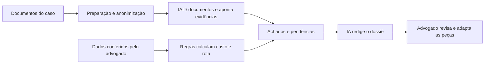

# Amparo

**Apoio à advocacia em demandas de saúde.**

A Amparo auxilia advogados e defensorias na preparação de ações judiciais para fornecimento de medicamentos pelo poder público. Reúne os documentos do caso, apresenta o cálculo do custo anual, indica a rota processual prevista nas regras implementadas e aponta informações que precisam de revisão antes da petição inicial.

Desenvolvida para o Hackathon da Cidadania OAB/PR 2026, na categoria Inovação Aberta.

[Usar a aplicação](https://amparo.mdgap.org/) · [Consultar o repositório](https://github.com/paulojalowyj/mindthegap-hackathon2026)

As saídas são minutas e indicações para conferência profissional. A Amparo não protocola ações, decide o direito ao medicamento ou substitui o advogado responsável.

## Conteúdo

- [O problema e a proposta](#o-problema-e-a-proposta)
- [Como usar](#como-usar)
- [Onde a IA participa](#onde-a-ia-participa)
- [Documentos e fontes](#documentos-e-fontes)
- [Demonstração e avaliação funcional](#demonstração-e-avaliação-funcional)
- [Privacidade e persistência](#privacidade-e-persistência)
- [Estrutura técnica](#estrutura-técnica)
- [Executar localmente](#executar-localmente)
- [Testes de código](#testes-de-código)
- [Equipe](#equipe)
- [Licença](#licença)

## O problema e a proposta

Preparar um pedido judicial de medicamento exige reunir receita, laudo, resposta administrativa, preço e fundamentos jurídicos. Esses elementos chegam de fontes diferentes. O profissional precisa conferir sua consistência, identificar lacunas e avaliar o encaminhamento do caso.

A Amparo organiza essa preparação em quatro etapas. O advogado confirma as entradas numéricas, examina o cálculo e confronta cada achado com os documentos. Ao final, recebe minutas e uma lista de pendências para revisar.

Para a pessoa atendida, essa lista ajuda a entender quais documentos obter ou complementar. Redução de retrabalho, ganho de tempo e impacto no acesso ao tratamento são benefícios propostos que ainda precisam ser medidos com usuários.

## Como usar

Acesse a aplicação e abra **Novo caso**, caso o painel de casos seja exibido. Para demonstrações, use apenas dados fictícios.

| Etapa | O que o advogado faz | O que a ferramenta apresenta |
| --- | --- | --- |
| **1. Documentos** | Insere laudo médico, receita, pedido e resposta administrativa e, quando disponível, nota do e-NatJus. | Textos do caso para conferência e processamento. |
| **2. Conferência** | Confirma medicamento, apresentação, preço CMED, unidades por embalagem, posologia, registro sanitário e respostas complementares. | Entradas que alimentarão o cálculo e a avaliação dos requisitos. |
| **3. Achados** | Confere rota, memória de cálculo, trechos citados, fontes e pendências. | Custo anual, enquadramento nas regras implementadas, seis requisitos e alertas para revisão. |
| **4. Dossiê** | Revisa, adapta e copia as peças geradas. | Memorando de rota, requerimento administrativo, resumo de evidência, trecho de petição e pendências do cliente. |

### Como interpretar os estados

| Estado | Significado para a revisão |
| --- | --- |
| Evidência localizada | A análise encontrou informação relacionada ao requisito. Confira se o trecho realmente sustenta a conclusão. |
| Revisão necessária | A informação exige complementação ou exame do profissional. |
| Informação não localizada | A análise não encontrou informação suficiente nas entradas examinadas. |
| Não analisado | O requisito não foi avaliado, inclusive em situações de indisponibilidade da IA. |

Um estado verde não equivale à aprovação jurídica do caso. Quando houver pendências, as minutas precisam refletir o que falta e a situação administrativa já existente.

## Onde a IA participa

A implementação separa o cálculo da interpretação documental:



**Motor de regras.** Calcula quantidade de apresentações, custo anual e conversão em salários mínimos. Produz a rota, o polo passivo e a indicação de custeio conforme as regras codificadas. Os números usados pela análise são calculados fora do modelo de linguagem.

**Leitura documental.** Na versão documentada, uma chamada ao modelo examina quatro requisitos de origem documental: negativa administrativa, impossibilidade de substituição, medicina baseada em evidências e laudo fundamentado. Os dois itens relacionados à CONITEC e à incapacidade financeira são apurados pelas respostas do formulário.

**Redação.** Outra chamada recebe o contexto recuperado, os dados do medicamento, o cálculo, a rota e os achados para redigir as quatro peças do dossiê e as pendências. O profissional deve conferir também os números e as referências reproduzidos nas minutas.

A IA permite interpretar textos diferentes entre si e relacionar documentos, evidências e pendências. O valor proposto do produto está nessa leitura dentro de um fluxo de conferência, com cálculo separado e fontes acessíveis ao advogado.

### Prompts e transparência

| Arquivo | Papel |
| --- | --- |
| [sistema.ts](backend/src/llm/prompts/sistema.ts) | Define o papel de apoio ao advogado, as restrições de geração e as instruções sobre fontes. |
| [analisarTema6.ts](backend/src/llm/analisarTema6.ts) | Monta a tarefa de classificação, os documentos, os requisitos e o formato esperado dos achados. |
| [redigirDossie.ts](backend/src/llm/redigirDossie.ts) | Monta a solicitação de redação com os resultados já calculados e as pendências. |
| [catalogo.ts](backend/src/llm/catalogo.ts) | Prepara a explicação dos prompts para a ajuda contextual. |

A ajuda **Como a IA atua aqui** explica a finalidade de cada uso. O painel **Transparência: o que foi enviado ao modelo** mostra as mensagens da execução quando disponíveis na resposta. Abrir a ajuda não realiza uma nova chamada ao modelo.

As instruções pedem evidências e fontes, mas não garantem que todas as citações sejam corretas ou que cada trecho sustente a conclusão. Validar o formato da resposta também não valida seu conteúdo jurídico.

## Documentos e fontes

O acervo versionado em [backend/corpus](backend/corpus) contém textos selecionados de fontes oficiais. Antes da geração, o sistema busca até oito trechos para compor o contexto da IA. Essa recuperação de trechos é chamada de RAG.

| Fonte ou documento | Uso na implementação documentada |
| --- | --- |
| Temas 1234 e 500 do STF | Referências para as regras de rota e para o contexto normativo. |
| Tema 6 do STF | Organiza os seis requisitos apresentados em Achados. |
| Súmulas Vinculantes 60 e 61, trecho do Tema 793, Tema 106 do STJ, Lei 8.080/1990 e Guia Rápido do CNJ | Complementam o acervo recuperável para análise e redação. |
| Tabela CMED/ANVISA | A cópia importada no banco permite buscar apresentação e preço. O advogado confirma a seleção antes do cálculo. |
| Registro ANVISA, documentos da CONITEC, RENAME e PCDT | Apoiam a conferência profissional da situação do medicamento, da indicação e das alternativas. A presença de um produto na CMED não substitui a consulta do registro sanitário. |
| Laudo e receita | Fornecem o quadro clínico, o histórico terapêutico, a justificativa e a prescrição para confronto com os requisitos. |
| Pedido e resposta administrativa | Permitem examinar a tentativa de acesso, a decisão e os fundamentos informados nas peças. |
| Nota do e-NatJus | Oferece evidências e alternativas para confronto com o laudo. O profissional seleciona a nota pertinente. |

O acervo não corresponde a uma pesquisa atualizada em todos os portais a cada análise. A inclusão de uma fonte na base não significa que ela será recuperada em todas as respostas. A aplicabilidade dos precedentes e a atualização das informações exigem conferência profissional.

## Demonstração e avaliação funcional

Para conhecer o fluxo, use o botão **Carregar caso sintético**, quando disponível, e percorra as quatro etapas. Examine uma memória de cálculo, um achado, as mensagens enviadas ao modelo e uma minuta.

O ensaio registrado na documentação utilizou outro exemplo, **TESTE-DA-001**, com adulto fictício de 38 anos, dermatite atópica grave e negativa administrativa simulada. O caso carregado pelo botão não deve ser tratado como reprodução desse ensaio.

### Registro de 13/09/2026

| Item | Resultado registrado |
| --- | --- |
| Apresentação selecionada | CIBINQO 100 mg, 30 unidades; preço exibido de R$ 3.893,41 e tabela identificada como 2026-09. |
| Entrada para simulação | Uma unidade ao dia, durante 365 dias. |
| Cálculo | 13 apresentações; R$ 50.614,33 por ano; 31,22 salários mínimos segundo os parâmetros da execução. |
| Fluxo | Documentos, Conferência, Achados e Dossiê acessados. |
| Requisitos | Uma evidência localizada, três itens em revisão e dois sem informação. |
| Conferência e cópia | Achados e prompts abertos; memorando copiado e conferido. |

Os dados clínicos, a prescrição e a resposta administrativa desse caso são fictícios. O exemplo serve para testar o software e não orienta tratamento de pessoa real. Preços, parâmetros e saídas podem mudar entre execuções.

### Limitações observadas

A revisão dessa execução encontrou erros que precisam permanecer visíveis:

- O memorando atribuiu o Tema 6 ao STJ, embora seja do STF, e resumiu incorretamente os requisitos do Tema 106.
- Um achado afirmou faltar o tempo de uso da ciclosporina, embora o laudo informasse “por quatro meses”.
- Houve condensação de uma evidência que deveria ser confrontada com o trecho literal do documento.
- Uma pendência sugeriu buscar nota “favorável” do e-NatJus. A revisão deve considerar evidências pertinentes, inclusive desfavoráveis.

O fluxo funcionou nesse ensaio, mas as minutas exigiram correção. O teste não mediu ganho de tempo, precisão jurídica em uma amostra de casos ou usabilidade com advogados. PDF, OCR, busca no e-NatJus, bloqueio de CPF e uso em celular não foram exercitados nessa rodada.

## Privacidade e persistência

A implementação utiliza um serviço de anonimização na própria infraestrutura, com Presidio, spaCy e reconhecedores brasileiros. O texto destinado ao provedor de IA passa por esse processamento.

A aplicação mantém histórico com dados derivados do caso, resultados e minutas. Por isso, **não se deve afirmar que o sistema não persiste dados**. A anonimização pode falhar ou retirar contexto relevante e exige avaliação própria.

O cliente solicita ZDR ao provedor, uma configuração de retenção de dados. Essa solicitação não comprova, por si só, as práticas de todos os serviços envolvidos. Use dados sintéticos em demonstrações e mantenha credenciais fora do repositório.

## Estrutura técnica

```text
frontend/              Interface React 19, Vite, Tailwind 4 e HeroUI 3
backend/
  src/domain/          Cálculo, rota, requisitos, formulário e histórico
  src/llm/             Cliente do modelo, prompts e redação
  src/rag/             Recuperação de trechos do corpus
  corpus/              Acervo normativo versionado
  test/                Testes do backend
anonimizador/          Serviço de anonimização com Presidio e spaCy
docs/                  Arquitetura e instruções de implantação
```

A API usa Node.js e Fastify. O banco é PostgreSQL com pgvector. O fluxo de documentos inclui recursos de extração de PDF e OCR com Poppler e Tesseract. O Compose da versão de referência reúne quatro serviços: `web`, `api`, `db` e `anonimizador`.

Consulte [a arquitetura](docs/ARQUITETURA.md) e [as instruções de implantação](docs/DEPLOY.md), confrontando-as com os arquivos da versão utilizada.

## Executar localmente

As instruções abaixo se baseiam no código `75a3474cd14538beca916e57335a38e3b0ce3bce`, consultado em 12/09/2026. A instalação completa por Docker não foi executada no ensaio funcional. A branch `main` pode conter alterações posteriores.

### 1. Obter a versão de referência

Pré-requisitos: Git, Docker com suporte a Compose e conexão com a internet para baixar imagens, modelos e bases.

```bash
git clone https://github.com/paulojalowyj/mindthegap-hackathon2026.git
cd mindthegap-hackathon2026
git checkout 75a3474cd14538beca916e57335a38e3b0ce3bce
cp .env.deploy.example .env
```

### 2. Configurar o ambiente

Edite `.env` antes de iniciar:

| Variável | Configuração |
| --- | --- |
| `POSTGRES_PASSWORD` | Defina a senha do banco. É exigida pelo Compose. |
| `OPENROUTER_API_KEY` | Informe uma chave para habilitar a análise e a redação por IA. |
| `OPENROUTER_MODEL` | Padrão da referência: `openai/gpt-oss-120b`. |
| `EMBEDDINGS_MODEL` | Padrão: `voyageai/voyage-4-lite`. `none` seleciona a busca lexical. |
| `EMBEDDINGS_DIM` | Padrão: `1024`. Deve corresponder à dimensão configurada no banco. |

O provedor de modelos pode gerar custos. Não publique o arquivo `.env` preenchido.

### 3. Disponibilizar a interface local

O Compose de referência usa `expose` para comunicação entre serviços. Para abrir a interface no computador, crie `compose.local.yml` na raiz:

```yaml
services:
  web:
    ports:
      - "127.0.0.1:8080:80"
```

Inicie os serviços:

```bash
docker compose -f docker-compose.yml -f compose.local.yml up --build -d
```

Abra [http://127.0.0.1:8080](http://127.0.0.1:8080).

Na inicialização, a API executa migrações, tenta ingerir o corpus e verifica a carga CMED em segundo plano. A busca de preços pode ficar vazia enquanto essa carga não terminar. Para acompanhar:

```bash
docker compose -f docker-compose.yml -f compose.local.yml logs -f api
```

### Sem chave de API

O motor de regras pode apresentar os cálculos e a rota. A leitura documental fica indisponível e os requisitos sem análise devem ser sinalizados. Sem a geração do dossiê, a quarta etapa não fica disponível. A busca de contexto pode usar similaridade lexical em vez de vetores.

Esse funcionamento reduzido não garante operação sem rede: preços, notas técnicas e outros serviços podem depender de conexão.

## Testes de código

Com Node.js 22 ou superior, na raiz do repositório:

```bash
npm ci
npm test
```

Os scripts estão definidos no [package.json](package.json). Na cópia de referência, os testes cobrem casos como arredondamento das apresentações, fronteiras do cálculo de rota e tratamento de requisitos ausentes na resposta do modelo.

Em 12/09/2026, foram registrados **57 testes aprovados** no commit `75a3474`. Os testes de aplicação usam substitutos de serviços externos. Esse resultado não valida o modelo remoto, a anonimização em produção, o banco implantado ou a qualidade jurídica das minutas.

Para repetir uma avaliação funcional, registre versão do código, modelo, prompt, tabela de preços, entradas e saídas. A conferência das respostas pelo advogado complementa os testes automatizados.

## Equipe

| Integrante | Papel |
| --- | --- |
| Paulo Jalowyj | Tech Lead |
| Lucas Messias | Desenvolvedor |
| Vinicius Brunoni | Advogado |
| Geraldo Baranoski | Advogado |

## Licença

Código disponibilizado sob a [licença MIT](LICENSE). As fontes jurídicas e bases externas devem ser consultadas em suas publicações de origem.

---

Documentação atualizada em 13/09/2026. O ensaio funcional foi realizado no domínio público nessa data, sem identificação do commit implantado pela interface. A descrição técnica utiliza a versão de referência indicada acima; os dois registros não devem ser tratados como prova de uma mesma versão em produção.
